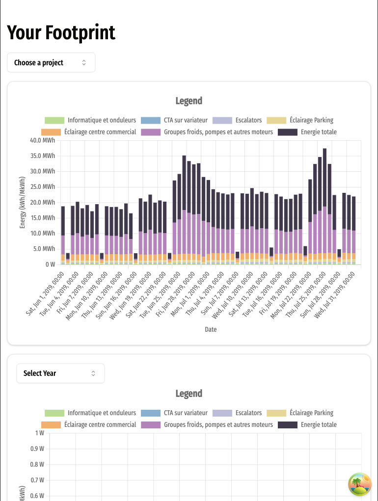

# Test métier React - Smart Impulse

See it live [here](https://test-metier-react-smart-impulse.vercel.app/) 🚨 Mais sans le data 🚨
🚨

The project brief (requirements) has moved to [BRIEF.md](BRIEF.md).

## Notable mentions pkgs

- `@tanstack-react-query` - pour fetch data facilement
- `shadcn` - ui component library qu'utilise tailwindcss
- `tailwindcss` - css utility classes lib
- `chartjs` et `react-chartjs-2` - pour constuire le graphs
- `typescript`

## Project Architecture

```tsx
data // mock data
|
src/ // client code - main app
 |
  api/ // actions for api calls
  |
  components/ // globally used components but sometimes components can have their own <utils> & <component> folders nested inside
    |
    ui/ // ui components only - installed individually by shadcn
  |
  hooks/ // global hooks
  |
  lib/  // automatically created by shadcn, utility functions for shadcn
  |
  types/ //  global types
  |
  utils/ //  global utils
  |
  global.css // main css file for the theme
  |
  tailwind.config.js // customization of some tailwind variables
```

## Run Locally

-`yarn install` pour installer le dependencies

-`yarn run start` pour lancer le tout

## Design Screens

More Design screens can be seen inside `pictures`


